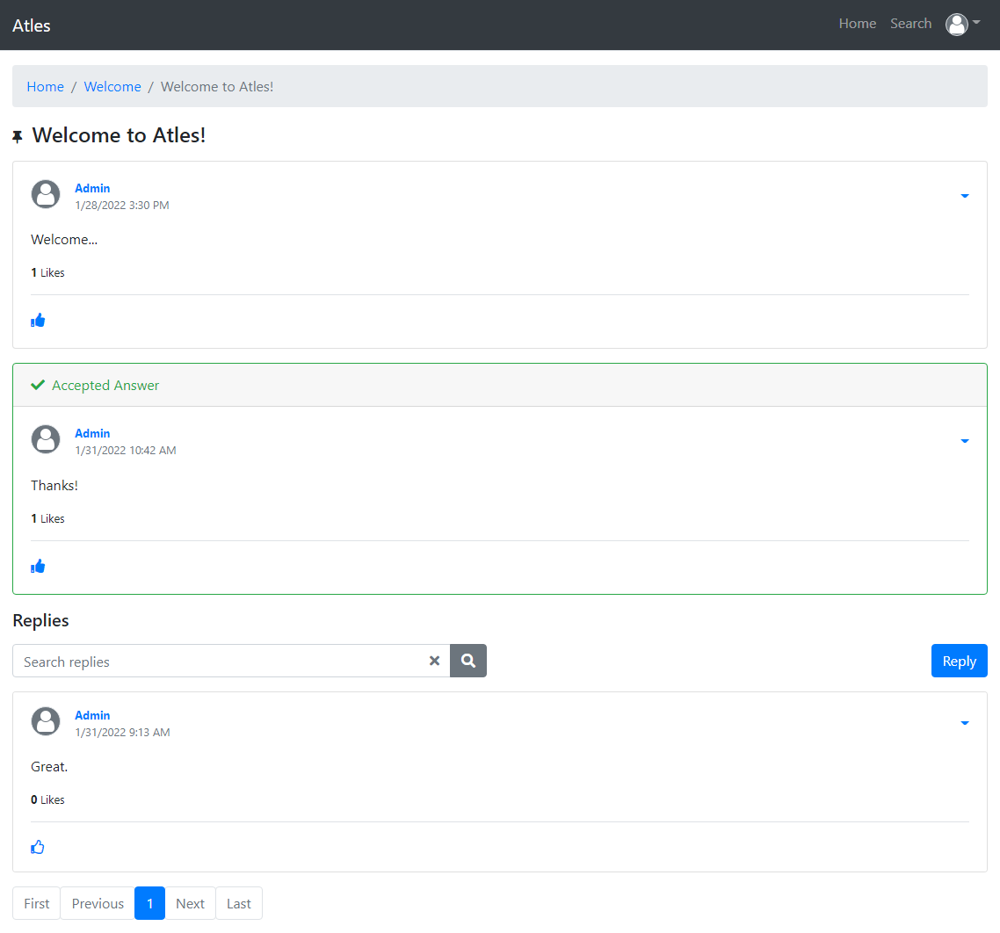
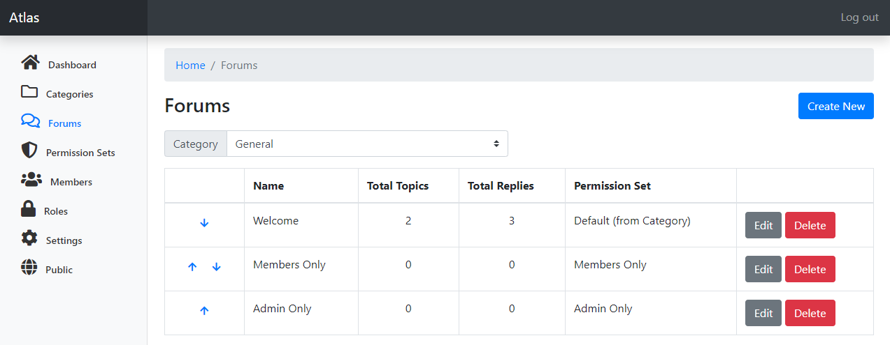
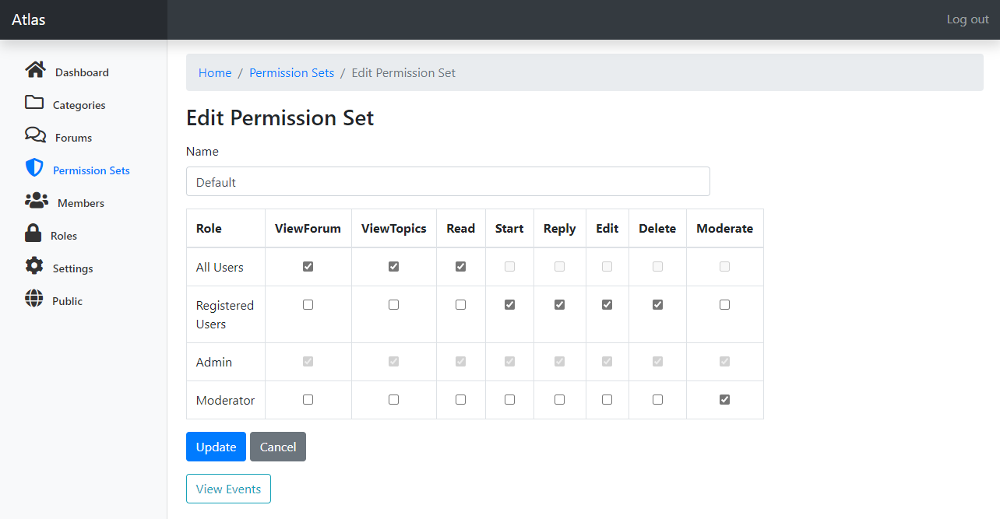

# PROJECT NO LONGER MAINTAINED

IT WAS MADE PRIVATE WHEN IT HAD **195 STARS** AND THEN MADE PUBLIC AGAIN FOR ARCHIVE PURPOSES

# Atles (Beta)

A forum software built with ASP.NET Blazor WebAssembly and CQRS.

**Documentation**: [Atles Wiki](https://lucabriguglia.github.io/Atles).

## Screenshots

**Topic View**

**Forums Admin**

**Permission Sets Admin**

## Technology

- Blazor WebAssembly 6.0.1
- Entity Framework Core 6.0.1
- SQL Server _(more providers to come)_
- Fluent Validation _(shared between client and server)_
- OneOf

## Features

- Post likes
- Topic subscriptions
- User Ranks and Badges _(work in progress)_
- Themes
- Multi language
- Granular permissions
- Markdown editor
- An existing ASP.NET Identity database can be used

## Run on local

- Clone the repository
- Run the **Atles.Server** project
- Database and default data will be created automatically
- Login with the default admin account:
  - **Email**: admin@default.com
  - **Password**: !P455w0rd?

**Note**: Please delete any databases previously created if you pull new versions. It's still a Beta version and some breaking changes might occur between commits.
