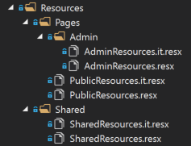
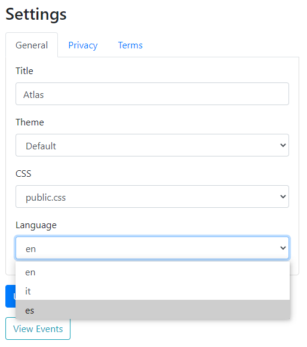

## Localization

In order to localise the application in a different language, there are three reource files the need to be created as shown below:
Copy/paste the three default files and add the culture suffix.



Add the culture code of the new language in the `Languages` configuration of app settings.

```
"Languages": "en,it,es",
```

The new language can then be selected in the Site Settings page of the Admin area:


