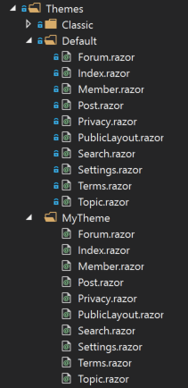
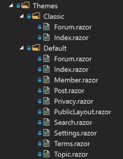
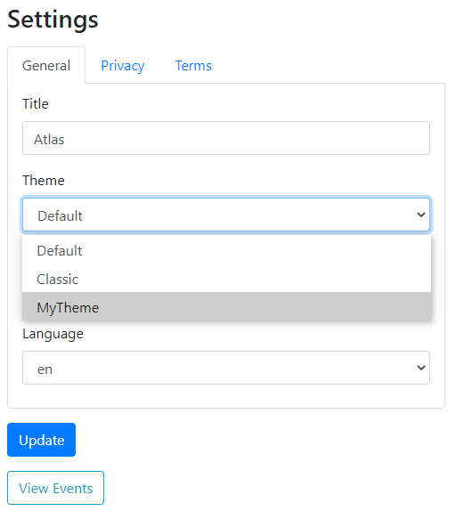
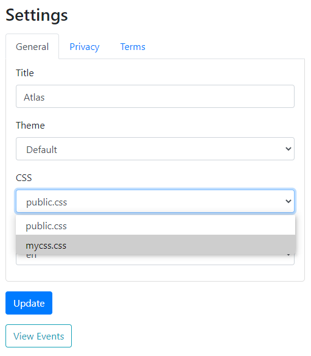

## Themes

This section explains how to customise the design of the public website.

- [Overview](#overview)
- [Creating a custom Theme](#custom-theme)

<a name="overview"></a>
### Overview

The look and feel of Atles can be changed with a combination of Theme and CSS.
You can use the same CSS file on diffrent Themes.
Therefore, you can use the default Theme and create a custom CSS file to override the Bootstrap 4 classes.
If you want to completely change the default layout and CSS, you can create a new Theme with cutom components and a new CSS file.

Available Themes and CSSs need to be configured in app settings of Atles.Server in order to be selectable in the Site Settings page of the Admin area.
Assuming your custom Theme is "MyTheme" and your custom CSS is "mycss.css" (to be added to wwwroot/css in Atles.Client) the app settings should look like the following:

```
"Themes": "Default,Classic,MyTheme",
"CSS": "public.css,mycss.css",
```

<a name="custom-theme"></a>
### Creating a custom Theme

You need to create a new sub-folder in the Themes folder.
For convenience you can just copy/paste the Default Theme which contains all components:



You can also create a new Theme with just the components you want to override as it is done for the Classic Theme.
If a component is not found in a Theme, Atles will use the one in the Default Theme:



Remember to add the new Theme in app settings as explained above in order for it to be selectable in Site Settings:



Same goes for the CSS:


